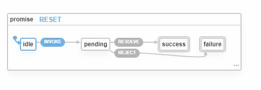

# Declare Your Intent: Creating Maintainable Web apps

This article shows how declarative style programming techniques can be used by teams to create maintainable web applications. First, we discuss how to use Typescript to make your code more expressive and resilient to change. Then we use finite state machines to streamline front-end development and increase stakeholder involvement in the development process.

## Why Declarative?

As a software application evolves and grows, managing complexity becomes key. As engineers, our focus should be to express the application behaviour as simply as possible.

Programming languages, libraries and frameworks help us express our intent and should make "doing the right thing" easy, reducing boilerplate and potential for bugs.

Consider evolution of programming languages for example.

[image here: arrow left (imperative) to right (declarative)]

- Assembly - describe how the computer should behave at very low level
- C - named variables and functions - model the domain
- C++, Java and many others - types, classes without sacrificing performance. Still telling the computer how to behave through imperative constructs.
- Haskell, Scala - declare how program should behave not how to do the work.

Javascript for Web development

[image here: arrow left (imperative) to right (declarative)]

- Direct DOM manipulation. Describe how the browser should
- jQuery. Higher-level DOM manipulation. Complex interactions become simple. Much freedom but difficult to maintain apps
- React, Vue, other frameworks - All have in common: UI elements are declared. Not how but what. Declarative not imperative. Making composition of simple components into large, complex apps possible.
- No-code platforms such as Webflow and integrations software such as Zapier now allow even complex websites to be configured (declared).

This article will show how some practical examples of maintainable practices that can be applied on a Node JS backend, JavaScript front-end and your shared validation layer.

## Declarative Programming on the backend with Node JS

### Controlling behaviour using types

**JavaScript**

Consider task of looking up a given user via their email address in JavaScript:

```js
function validateEmail(email) {
  if (typeof email !== "string") return false;

  return isWellFormedEmailAddress(email);
}

function lookupUser(validatedEmail) {
  // Assume a valid email is passed in.
  // Safe to pass this down to the database for a user lookup..
}
```

This function accepts an email address as string and returns the corresponding user from the database when there is a match.

The assumption is that `lookupUser` will only be called once basic validation has been performed. This is a key assumption. What if several weeks later some refactoring is performed and this assumption no longer holds? Fingers crossed that the unit tests catch the bug or we might be sending unfiltered strings to the database!

**Typescript, first attempt**

Let's a consider a TypeScript equivalent of the validation function:

```ts
function validateEmail(email: string) {
  // No longer needed the type check (typeof email === "string").
  return isWellFormedEmailAddress(email);
}
```

This is a slight improvement, with the TypeScript compiler having saved us from adding an additional run-time validation step.

The safety guarantees that strong typing can bring have not really been taken advantage of yet. Let's look into that.

**Typescript, second attempt**

```ts
type ValidEmail = { value: string };

function validateEmail(input: string): Email | null {
  if (!isWellFormedEmailAddress(input)) return null;

  return { value: email };
}

function lookupUser(email: ValidEmail): User {
  // No need to perform validation. Compiler has already ensured only valid emails have been passed in.

  return lookupUserInDatabase(email.value);
}
```

This is better but is cumbersome. All uses of `ValidEmail` access the actual address through `email.value`. TypeScript employs _structural_ rather than the _nominal_ typing employed by languages such as Java and C#. While powerful, this means any other type that adheres to this signature is deemed equivalent. For example, the following password type could be passed to lookupUser() without complaint from the compiler:

```ts
type ValidPassword = { value: string };

const password = { value: "password" };

lookupUser(password); // No error.
```

**Typescript, third attempt**

```ts
type ValidEmail = string & { _: "ValidEmail" };

function validateEmail(input: string): ValidEmail {
  // Perform email validation checks..

  return input as ValidEmail;
}

type ValidPassword = string & { _: "ValidPassword" };
function validatePassword(input: string): ValidPassword { ... }

lookupUser("email@address.com"); // Error: expected type ValidEmail.
lookupUser(validatePassword("MyPassword"); // Error: expected type ValidEmail.
lookupUser(validateEmail("email@address.com")); // Ok.
```

> **Tip:** Apply this pattern easily using the following helper type:
>
> ```ts
> type Opaque<K, T> = T & { __TYPE__: K };
>
> type Email = Opaque<"Email", string>;
> type Password = Opaque<"Password", string>;
> type UserId = Opaque<"UserId", number>;
> ```

By strongly typing entities in your domain, we can:

1. reduce the number of checks needing to be performed at runtime which consume precious server CPU cycles
2. maintain fewer basic tests due to the guarantees the TypeScript compiler provides
3. take advantage of editor- and compiler-assisted refactoring
4. improve code readability with better [signal to noise](https://dzone.com/articles/whats-your-signal-noise-ratio)

## Declarative User Interfaces

React was open-sourced by Facebook in 2013 and significantly altered the course of both front-end development. When I first used it, I loved how I could _declare_ the GUI as a function of the application's state. I was now able to compose large and complex UIs from smaller building blocks without dealing with the messy details of DOM manipulation and tracking which parts of the app need updating in response to user actions. I could now largely ignore the _time_ aspect when defining the UI and focus on applying correct state changes.

To unlock a new simpler way to develop UIs, React inserted an abstraction layer between the developer and the machine (browser): the virtual DOM. Other new frameworks have also bridged this gap, albeit in different ways: for example, via functional reactivity through clever use of JavaScript getters/setters (Vue) or through compilation (Svelte).

### Declarative Application State and Logic

While the presentation layer continues to revolve around some form of `html` or another (e.g. JSX in React, html-based templates found in Vue, Angular and Svelte), the problem of how to model an application's state in a way that is easily understandable to other developers and maintainable as the application grows continues. This continues be seen through a proliferation of state management libraries and approaches.

It doesn't help that the industry keeps demanding more from software. Some emerging challenges that modern state management approaches must support:

- offline-first applications using advanced subscription and caching techniques
- concise code for ever-shrinking bundle size requirements
- demand for increasingly sophisticated user experiences through high fidelity animations and real-time updates

### (Re)emergence of Finite State Machines

Finite-state machines have been used extensively for software development in certain industries where application robustness is critical such as aviation and finance. It's also steadily gaining in popularity for front-end development of webapps through [XState library](https://github.com/davidkpiano/xstate) with 0.5 million weekly downloads.

[Wikipedia defines a finite-state machine](https://en.wikipedia.org/wiki/Finite-state_machine) (FSM) as:

> an abstract machine that can be in exactly one of a finite number of states at any given time. The FSM can change from one state to another in response to some external inputs; the change from one state to another is called a transition. An FSM is defined by a list of its states, its initial state, and the conditions for each transition.

And further:

> A state is a description of the status of a system that is waiting to execute a transition.

## Declare The Application Logic

There are many ways to go about implementing a FSM in JavaScript.

### Finite state machine as a switch statement

Here's a machine describing the possible states that a JavaScript can be in, implemented using a switch statement:

```js
const initialState = {
  type: 'idle',
  error: undefined,
  result: undefined
};

function transition(state = initialState, action) {
  switch (action) {
    case 'invoke':
      return { type: 'pending' };
    case 'resolve':
      return { type: 'completed', result: action.value };
    case 'error':
      return { type: 'completed', error: action.error ;
    default:
      return state;
  }
}
```

If you've used popular React state library Redux, does this style of code seem familiar?

### Finite state machine as a JavaScript object

Here's the same machine implemented as a JavaScript object using XState:

```js
const promiseMachine = Machine({
  id: "promise",
  initial: "idle",
  context: {
    result: undefined,
    error: undefined,
  },
  states: {
    idle: {
      on: {
        INVOKE: "pending",
      },
    },
    pending: {
      on: {
        RESOLVE: "success",
        REJECT: "failure",
      },
    },
    success: {
      type: "final",
      actions: assign({
        result: (context, event) => event.data,
      }),
    },
    failure: {
      type: "final",
      actions: assign({
        error: (context, event) => event.data,
      }),
    },
  },
});
```

While the XState version is less compact, the object representation has several advantages:

- The state machine itself is simple JSON which can be easily persisted
- Because it is declarative, the machine can be visualized
- If using TypeScript, the compiler checks that only valid state transitions are performed

[Statecharts visualization](https://xstate.js.org/viz/) of a promise:



## XState best practices

The following are some best practices to keep in mind when writing applications using XState.

### Separate side effects from logic

- Assist detection of logic errors by keeping the state machine code as clean and simple as possible.
- Easily visualize the state machine without needing to remove extra boilerplate first.
- Easier testing of the state machine by injecting mock services.

```js
const fetchUsersMachine = Machine({
  id: "fetchUsers",
  initial: "idle",
  context: {
    users: undefined,
    error: undefined,
    nextPage: 0,
  },
  states: {
    idle: {
      on: {
        FETCH: "fetching",
      },
    },
    fetching: {
      invoke: {
        src: (context) =>
          fetch(`url/to/users?page=${context.nextPage}`).then((response) =>
            response.json()
          ),
        onDone: {
          target: "success",
          actions: assign({
            users: (context, event) => [...context.users, ...event.data], // Data holds the newly fetched users
            nextPage: (context) => context.nextPage + 1,
          }),
        },
        onError: {
          target: "failure",
          error: (_, event) => event.data, // Data holds the error
        },
      },
    },

    // success state..

    // failure state..
  },
});
```

While it's tempting to write state machines in this way while you're still getting things working, a better separation of concerns is achieved by passing side effects as options:

```js
const services = {
  getUsers: (context) => fetch(
    `url/to/users?page=${context.nextPage}`
  ).then((response) => response.json())
}

const fetchUsersMachine = Machine({
  ...
  states: {
    ...
    fetching: {
      invoke: {
        // Invoke the side effect at key: 'getUsers' in the supplied services object.
        src: 'getUsers',
      }
      on: {
        RESOLVE: "success",
        REJECT: "failure",
      },
    },
    ...
  },
  // Supply the side effects to be executed on state transitions.
  { services }
});
```

This also allows for easy unit testing of the state machine, allowing explicit mocking of user fetches:

```js
async function testFetchUsers() {
  return [{ name: "Peter", location: "New Zealand" }];
}

const machine = fetchUsersMachine.withConfig({
  services: {
    getUsers: (context) => testFetchUsers(),
  },
});
```

### Divide and conquer mercilessly

It's not always immediately obvious how best to structure a problem domain into a good Finite State Machine hierarchy when starting out.

Tip: Use the hierarchy of your UI components to help guide this process.

A major benefit of using state machines is to explicitly model all the states and transitions between states in your applications so that the resulting behaviour is clearly understood making logic errors or gaps easy to spot.

In order for this to work well, machines need to be kept small and concise. Fortunately, composing state machines hierarchically is easy.

Music synthesizer:

- Outer machine has states: settingUp, running, paused
- Inner machine has ?

### Establish strict 1-1 mapping between state machines and stateful UI components

A fictional eCommerce website may have the following basic pages/views (written using React, Vue or Svelte for example):

- App
  - SigninForm
  - RegistrationForm
  - Products
  - Cart
  - Admin
    - Users
    - Products
  - etc...

The corresponding finite state machines would typically look something like:

- appMachine
  - signinMachine
  - registrationMachine

## Wrapping up

Declarative programming has seen a huge increase in popularity over the last 10 years.

The idea of declaring how an application behaves through GUIs is taking off and forms the basis of the no-code movement.

We can increase the value of every line of code we write by utilizing terminology from the business domain we're in and also open the development process up to non-technical people by visualizing the business logic.
